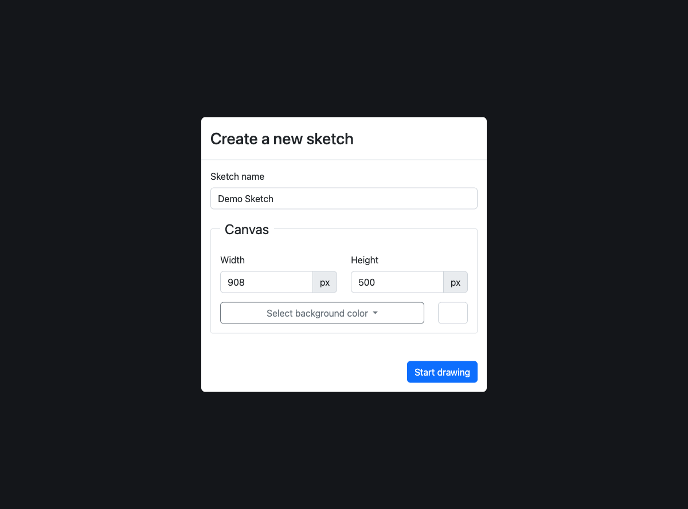
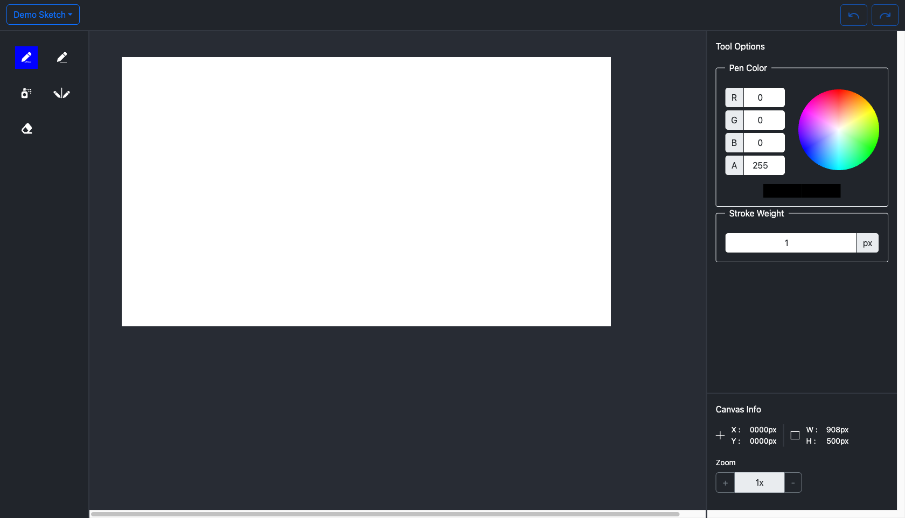
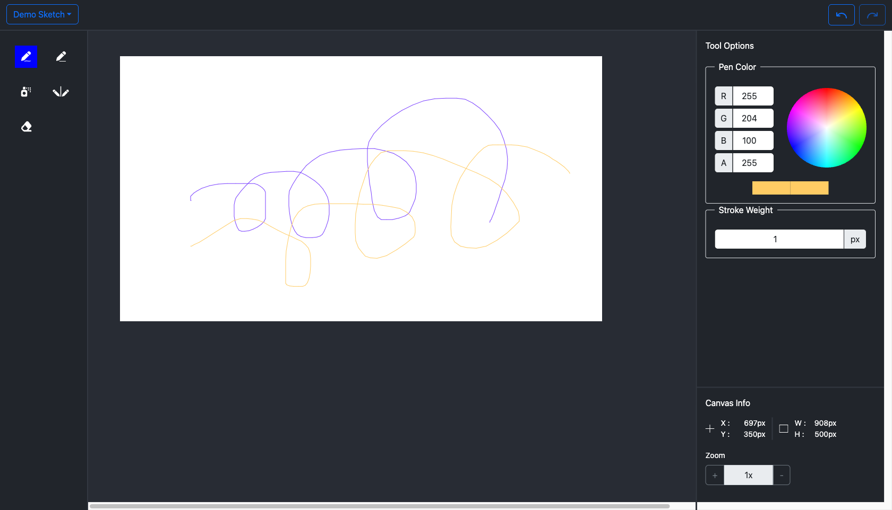
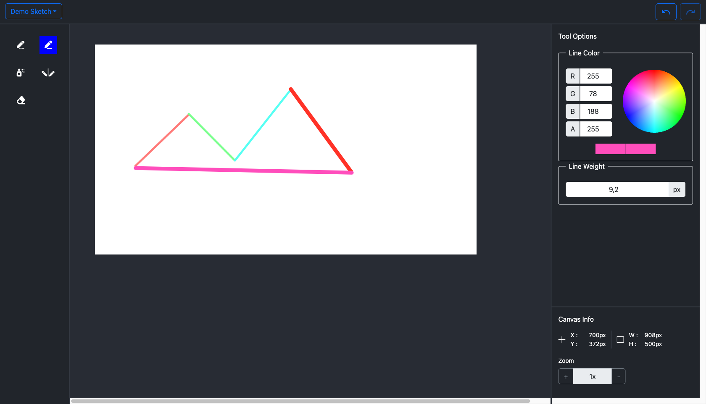
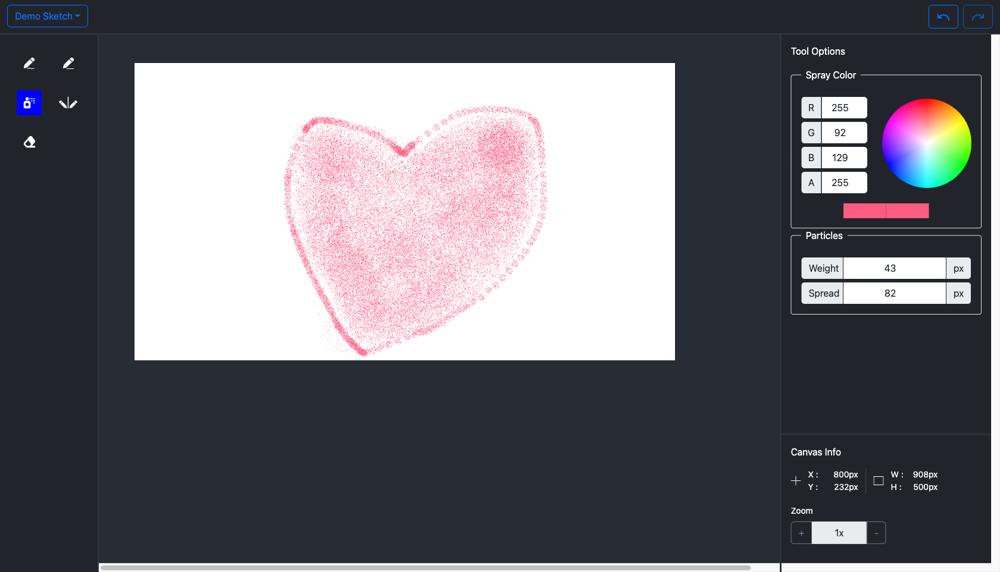
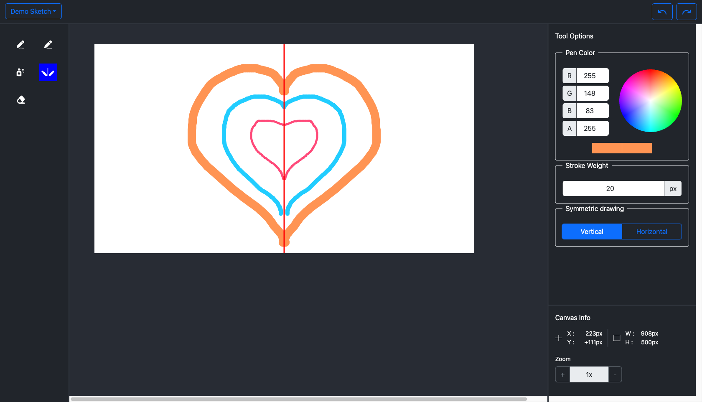
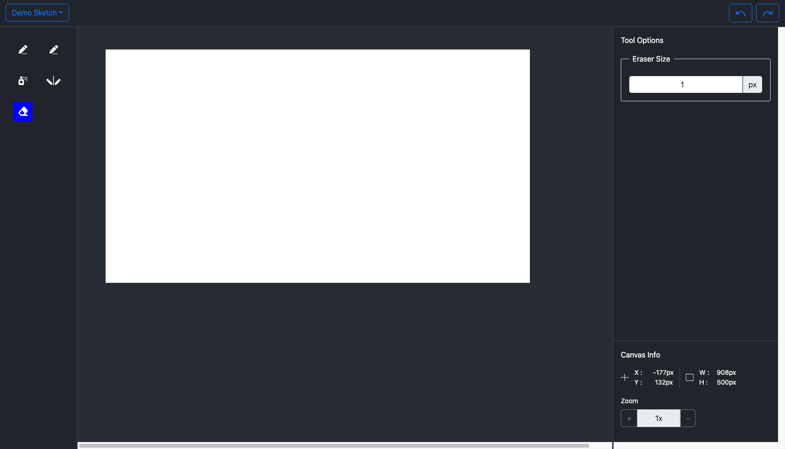

# Drawing App - A UoL Project

<p align="center">

</p>

---

## Overview

This Drawing App is a web-based painting application built as part of a University of London coursework project. It provides a comprehensive set of drawing tools that allow users to create digital artwork directly in their web browser. The application uses the **p5.js** library for canvas manipulation and provides a modern, intuitive interface for artists of all skill levels.

## Features

### Drawing Tools

The application includes five distinct painting tools:

1. **Freehand Tool** - A pen/pencil tool for freehand drawing with customizable stroke color and weight
2. **Line Tool** - For drawing straight lines between two points
3. **Spray Can Tool** - Creates spray paint effects with adjustable particle count and spread
4. **Mirror Draw Tool** - Enables symmetric drawing along vertical or horizontal axes
5. **Eraser Tool** - For removing parts of the drawing

### Canvas Configuration

- **Sketch Setup Popup** - Configure canvas before starting:
  - Sketch name
  - Canvas width and height (in pixels)
  - Background color (White, Grey, or Black)

### Tool Properties Panel

Each tool has customizable properties displayed in the right panel:

- **Color Picker** - RGB values with interactive color wheel
- **Stroke Weight** - Adjustable line thickness
- **Spray Settings** - Particle weight and spread controls
- **Symmetry Options** - Vertical or horizontal mirror axis

### Additional Features

- **Undo/Redo** - Full history navigation
- **Clear Canvas** - Reset to background color
- **Save Image** - Download drawing as image file
- **Canvas Zoom** - Zoom in/out (1x to 5x)
- **Mouse Coordinates** - Real-time position tracking
- **Canvas Size Display** - Shows dimensions in the info panel

---

## Technical Details

### Languages & Libraries

- **JavaScript** - Core application logic
- **p5.js** - Canvas manipulation and drawing functionality
- **jQuery** - DOM manipulation and event handling
- **Bootstrap 5** - UI framework for styling
- **HTML5/CSS3** - Structure and styling

### Architecture

The application follows an object-oriented design with clear separation of concerns:

- **Tool Pattern** - All drawing tools extend a base `Tool` class
- **Instance Mode** - p5.js runs in instance mode to avoid conflicts with other libraries
- **Layer System** - Each tool maintains its own drawing layer for non-destructive editing
- **History Management** - Canvas history tracker enables undo/redo functionality

### Project Structure

```
src/
├── core/
│   ├── sketch.js              # Main p5.js sketch (instance mode)
│   ├── sketchConfiguration.js # Canvas setup popup controller
│   └── toolbox.js             # Tool container and manager
├── tools/
│   ├── tool.js                # Base tool class
│   ├── freehandTool.js        # Freehand drawing tool
│   ├── lineToTool.js          # Line drawing tool
│   ├── sprayCanTool.js        # Spray paint tool
│   ├── mirrorDrawTool.js      # Symmetric drawing tool
│   └── eraser.js              # Eraser tool
├── options/
│   ├── toolOption.js          # Base option class
│   ├── colorPicker.js         # RGB color picker with wheel
│   ├── strokeWeight.js        # Line thickness control
│   ├── symmetry.js            # Mirror axis selection
│   └── spray.js               # Spray particle settings
├── helpers/
│   ├── sketchActions.js       # Drawing action handlers
│   ├── canvasHistory.js       # Undo/redo history
│   └── stack.js               # History stack data structure
└── main.js                    # Application entry point
```

---

## Screenshots

### 1. Sketch Setup Popup



The initial popup allows users to configure their canvas before starting to draw. Users can specify the sketch name, canvas dimensions (width and height in pixels), and choose from three background colors (White, Grey, or Black).

---

### 2. Main Drawing Interface



The main interface features:
- **Top Bar**: Sketch title dropdown with save/clear actions, undo/redo buttons
- **Left Sidebar**: Tool selection icons (5 tools available)
- **Center**: Drawing canvas
- **Right Panel**: Tool options and canvas information (mouse position, dimensions, zoom)

---

### 3. Freehand Tool



The Freehand tool is the default drawing tool. When selected, the right panel shows:
- **Pen Color**: RGB + Alpha color picker
- **Stroke Weight**: Line thickness in pixels

Draw continuous strokes by clicking and dragging on the canvas.

---

### 4. Line Tool



The Line tool creates straight lines between two points. Options include:
- **Line Color**: Customizable color
- **Line Weight**: Line thickness

Click and drag to define the start and end points of the line.

---

### 5. Spray Can Tool



The Spray Can tool creates spray paint effects. Options include:
- **Spray Color**: Color of the spray
- **Particles Weight**: Size of each particle
- **Particles Spread**: Distribution radius

Click or hold on the canvas to spray particles.

---

### 6. Mirror Draw Tool



The Mirror Draw tool enables symmetric artwork creation. Options include:
- **Pen Color**: Drawing color
- **Stroke Weight**: Line thickness
- **Symmetric drawing**: Toggle between Vertical or Horizontal axis

A red symmetry line appears on the canvas to guide the user. Every stroke is automatically mirrored across the selected axis.

---

### 7. Eraser Tool



The Eraser tool removes parts of the drawing. Options include:
- **Eraser Size**: Adjustable brush size

---

## Usage

### Running the Application

Open `index.html` in a web browser. The application will display the setup popup where you can configure your canvas. Click "Start drawing" to begin.

### Saving Your Work

Click on the sketch name in the top-left corner to access the dropdown menu, then select "Save image" to download your artwork.

### Zoom Controls

Use the zoom buttons (+) and (-) in the canvas info panel to zoom in or out (1x to 5x).

---

## License

This project was created as part of a University of London coursework assignment.

---

## Acknowledgments

- University of London
- p5.js community
- Bootstrap framework
